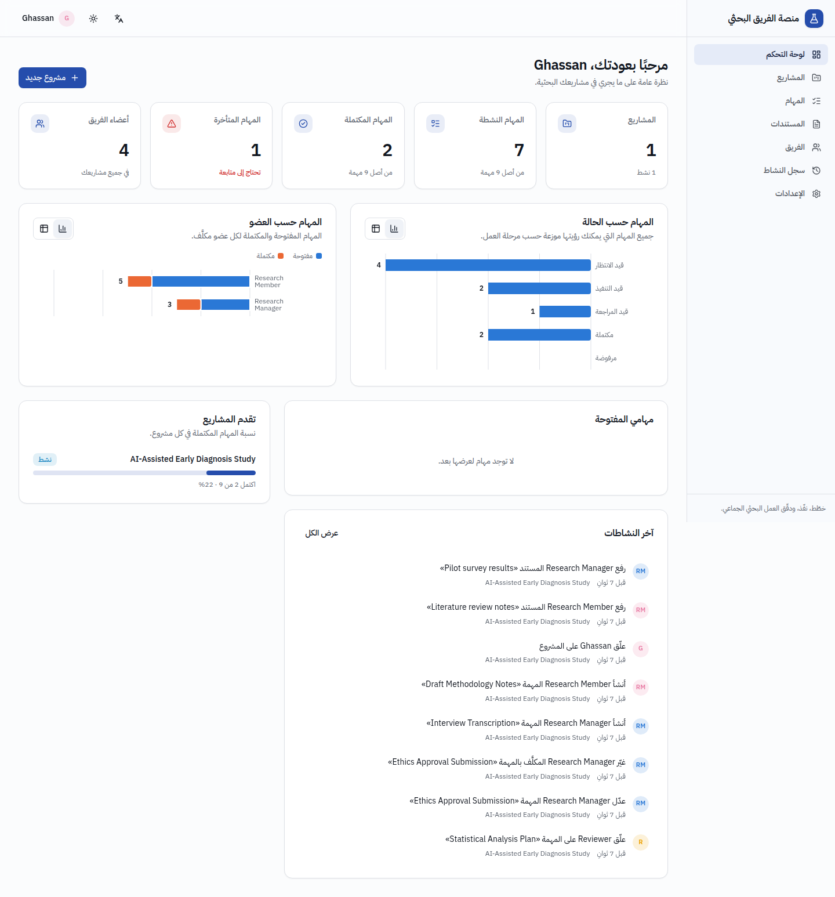
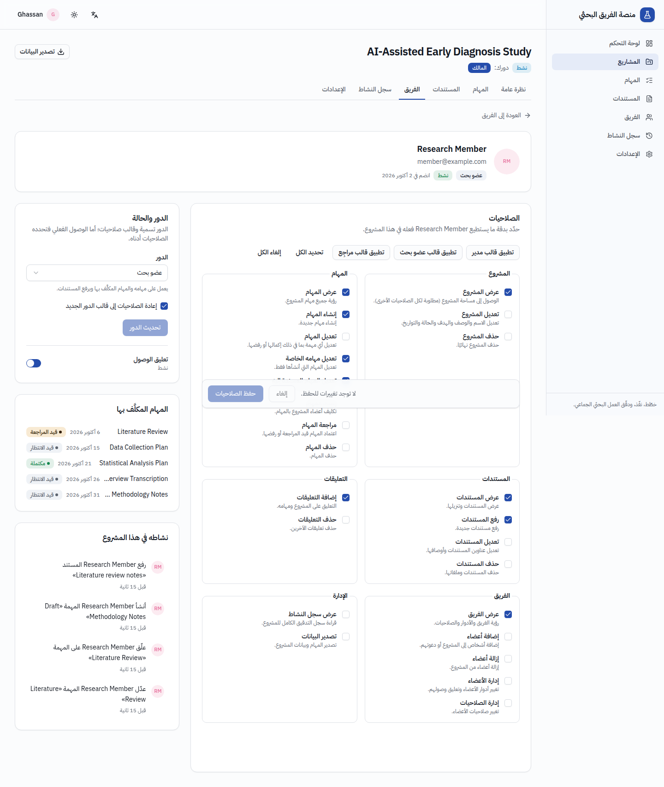
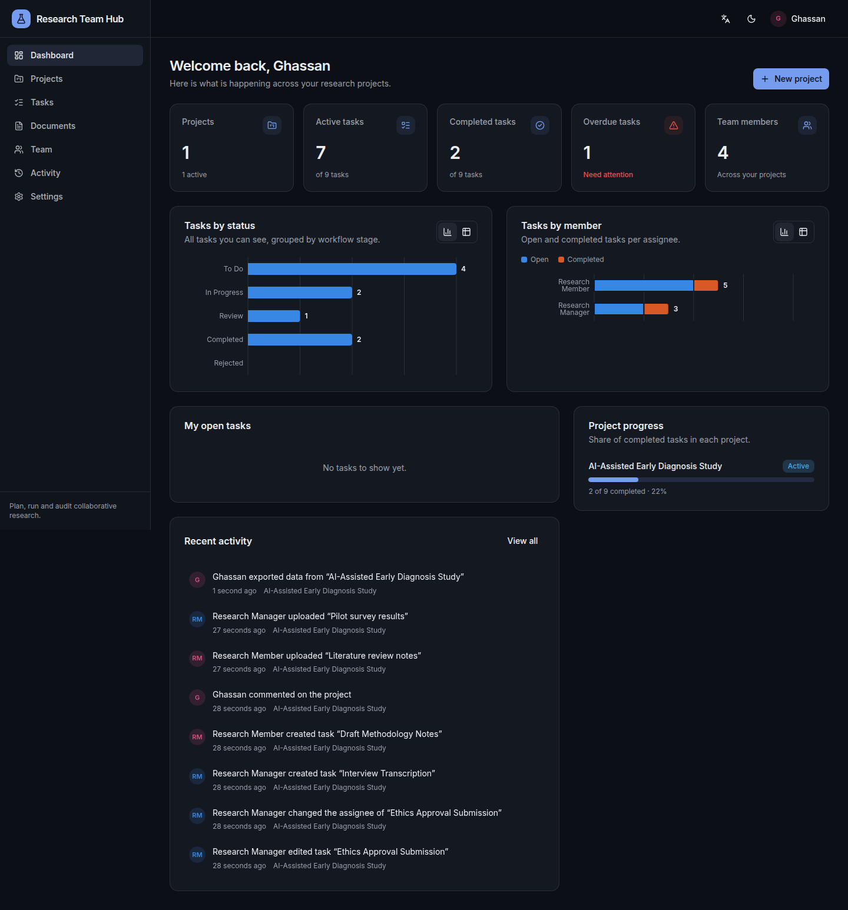

# Research Team Platform

منصة لإدارة الفرق البحثية — a full-stack platform for research teams: projects,
tasks, documents, discussions, a per-member permission system and an immutable
activity log. Arabic-first (RTL) with English, light and dark themes.

Built with Next.js 16, TypeScript, Tailwind CSS 4, shadcn/ui and Supabase
(Auth, PostgreSQL, Storage). **Every permission is enforced by the database**
(Row Level Security, column privileges, triggers and checked RPCs), so a request
that bypasses the UI is rejected exactly like a hidden button.

| Dashboard (Arabic)                              | Member permissions                                         | Dashboard (English, dark)                                 |
| ----------------------------------------------- | ---------------------------------------------------------- | --------------------------------------------------------- |
|  |  |  |

## Features

- **Projects** — name, description, research goal, status, start date,
  deadline, owner, members, tasks, documents, comments and activity; projects
  are fully isolated from each other.
- **Flexible permissions** — roles (Owner, Manager, Research Member, Reviewer)
  are only templates; each member's 24 permissions can be adjusted per project
  on _Team → Member → Permissions_. Anti-escalation rules: nobody can change
  their own permissions or grant a permission they do not hold.
- **Tasks** — statuses To Do / In Progress / Review / Completed / Rejected,
  priorities Low → Critical, assignee, due dates, overdue detection, review
  workflow, filters and search. _Edit own_ and _edit assigned_ are separate
  permissions.
- **Documents** — private Supabase Storage, direct signed uploads (50 MB,
  allow-listed types), signed downloads, metadata editing.
- **Comments** on projects and tasks; edits and deletions are audited.
- **Activity log** — who did what, when, on which entity, with old/new values,
  IP address and user agent; immutable; full log only with _View Activity
  Log_.
- **Dashboard** — projects, active/completed/overdue tasks, team size, recent
  activity, progress per project, tasks by status and by member (charts with
  an accessible table view); adapts to the user's permissions.
- **Team** — add existing users or invite by e-mail, change roles, suspend,
  remove, transfer ownership.
- **Auth** — sign up with e-mail confirmation, login, forgot/reset password,
  logout, invitations, protected routes, platform administrators.
- **Export** — tasks as CSV (opens correctly in Excel, formula-injection
  safe) or the whole project (details, tasks, documents, comments, team) as
  JSON, limited to what the user may see; every export is audited.

## Documentation

| Document                                     | Contents                                                                                     |
| -------------------------------------------- | -------------------------------------------------------------------------------------------- |
| [docs/ARCHITECTURE.md](docs/ARCHITECTURE.md) | A. Architecture overview · B. Folder structure · C. Database ERD · F. Implementation roadmap |
| [docs/PERMISSIONS.md](docs/PERMISSIONS.md)   | D. Permission model: catalog, templates, rules per area, where each rule is enforced         |
| [docs/SECURITY.md](docs/SECURITY.md)         | E. Security model: layers, threat model, operating guidance                                  |
| [docs/DEPLOYMENT.md](docs/DEPLOYMENT.md)     | Free deployment step by step — Supabase Free + Vercel Hobby (Arabic)                         |

## Quick start (local)

Requirements: Node.js 20.9+ (22 recommended), npm, Docker (for the local
Supabase stack).

```bash
cd research-team-platform
npm install

# 1. Start Supabase locally (Postgres, Auth, Storage, Mailpit). The first start
#    applies every migration in supabase/migrations.
npx supabase start

# 2. Configure the app with the values printed by the CLI
cp .env.example .env.local
npx supabase status -o env   # API_URL, ANON_KEY, SERVICE_ROLE_KEY
#    NEXT_PUBLIC_SUPABASE_URL      = API_URL
#    NEXT_PUBLIC_SUPABASE_ANON_KEY = ANON_KEY
#    SUPABASE_SERVICE_ROLE_KEY     = SERVICE_ROLE_KEY

# 3. Demo data (users, project, tasks, comments, documents, activity)
npm run seed

# 4. Run the app
npm run dev
```

Open <http://localhost:3000>. E-mails sent locally (confirmations, password
resets, invitations) appear in Mailpit at <http://127.0.0.1:54324>.

### Demo accounts

`npm run seed` creates (or updates) these users and the project
_AI-Assisted Early Diagnosis Study_ with tasks, comments, documents and an
authentic activity log (every step is performed through the API as the
respective user):

| User             | E-mail                 | Role                  |
| ---------------- | ---------------------- | --------------------- |
| Ghassan          | `ghassan@example.com`  | Owner, platform admin |
| Research Manager | `manager@example.com`  | Manager               |
| Research Member  | `member@example.com`   | Research Member       |
| Reviewer         | `reviewer@example.com` | Reviewer              |

The password is `SEED_USER_PASSWORD` from `.env.local`; when it is empty a
random password is generated and printed. `SEED_EMAIL_DOMAIN` changes the
domain. `npm run seed -- --reset` deletes and recreates the demo project.

## Environment variables

Copy `.env.example` to `.env.local` (local) or add the variables in Vercel →
Project → Settings → Environment Variables. **Never commit real values** —
`.env*.local` is git-ignored.

| Variable                                                  | Required     | Where to find it                                                                                                                                                                                                              | Exposure                                           |
| --------------------------------------------------------- | ------------ | ----------------------------------------------------------------------------------------------------------------------------------------------------------------------------------------------------------------------------- | -------------------------------------------------- |
| `NEXT_PUBLIC_SUPABASE_URL`                                | Yes          | Supabase dashboard → _Project Settings → Data API_ (Project URL), or the _Connect_ dialog. Local: `API_URL`.                                                                                                                  | Browser (public)                                   |
| `NEXT_PUBLIC_SUPABASE_ANON_KEY`                           | Yes          | _Project Settings → API Keys_: the **publishable** key (`sb_publishable_…`) or the legacy **anon** key. Local: `ANON_KEY`.                                                                                                    | Browser (public, protected by RLS)                 |
| `SUPABASE_SERVICE_ROLE_KEY`                               | Recommended  | _Project Settings → API Keys_: a **secret** key (`sb_secret_…`) or the legacy **service_role** key. Local: `SERVICE_ROLE_KEY`. Needed for e-mail invitations, removing a deleted project's files and `PLATFORM_ADMIN_EMAILS`. | **Server only** — never prefix with `NEXT_PUBLIC_` |
| `NEXT_PUBLIC_SITE_URL`                                    | Production   | Your public URL, e.g. `https://research.example.org` (used in e-mail links and to mark cookies `Secure`).                                                                                                                     | Browser                                            |
| `PLATFORM_ADMIN_EMAILS`                                   | First deploy | Comma-separated e-mails promoted to platform admin after a confirmed sign-in.                                                                                                                                                 | Server                                             |
| `APP_TIMEZONE`                                            | No           | IANA zone used for "overdue" and dates, e.g. `Asia/Gaza` (default `UTC`).                                                                                                                                                     | Server                                             |
| `NEXT_PUBLIC_DEFAULT_LOCALE`                              | No           | `ar` (default) or `en`.                                                                                                                                                                                                       | Browser                                            |
| `SEED_USER_PASSWORD`, `SEED_EMAIL_DOMAIN`, `DATABASE_URL` | Scripts only | Demo seed and `npm run db:types`; not needed on Vercel.                                                                                                                                                                       | Local                                              |

## Using a hosted Supabase project

1. Create a project at [supabase.com](https://supabase.com) and copy the URL
   and keys (table above) into `.env.local`.
2. Apply the migrations:
   ```bash
   npx supabase login
   npx supabase link --project-ref <your-project-ref>
   npx supabase db push
   ```
   This creates the schema, permission catalog, policies, functions and the
   private `project-documents` storage bucket. Without installing the CLI:
   run `npm run db:bundle` and paste the generated `supabase-setup.sql` into
   _Dashboard → SQL Editor_ once, on the new project (it records the
   migrations, so `db push` keeps working for future ones).
3. _Authentication → URL Configuration_: set **Site URL** to your domain and
   add `https://<domain>/auth/confirm` and `https://<domain>/auth/callback`
   (plus `http://localhost:3000/...` for development) to **Redirect URLs**.
4. _Authentication → Emails → Templates_: paste the templates from
   `supabase/templates/` (Confirm signup → `confirmation.html`, Invite user →
   `invite.html`, Reset password → `recovery.html`, Change e-mail address →
   `email_change.html`). They link to `/auth/confirm` with a `token_hash`, which
   works across browsers and devices.
5. Keep _Confirm email_ enabled and configure a custom SMTP server for
   production e-mail.
6. Become platform admin (allowed to create projects): sign up with an
   address listed in `PLATFORM_ADMIN_EMAILS`, or run
   `npm run admin:promote -- you@example.org`.

## Deploying to Vercel

A complete free-tier walkthrough (Supabase Free + Vercel Hobby + free SMTP)
is in [docs/DEPLOYMENT.md](docs/DEPLOYMENT.md).

1. Import the GitHub repository in Vercel and set **Root Directory** to
   `research-team-platform` (framework preset: Next.js).
2. Add the environment variables (Production and Preview).
3. Deploy, then add the Vercel domain to the Supabase _Site URL_ /
   _Redirect URLs_ (step 3 above) and set `NEXT_PUBLIC_SITE_URL`.

Security headers (CSP, HSTS, frame protection) are configured in
`next.config.ts`; HTTPS-only directives activate automatically when the
Supabase URL uses HTTPS.

## Scripts

| Command                                       | Purpose                                                         |
| --------------------------------------------- | --------------------------------------------------------------- |
| `npm run dev` / `build` / `start`             | Develop, build and serve the app                                |
| `npm run lint` · `typecheck` · `format:check` | ESLint, TypeScript (with Next.js route types), Prettier         |
| `npm test`                                    | Unit tests (Vitest)                                             |
| `npm run test:db`                             | pgTAP database suite on the local Supabase stack                |
| `npm run test:db:local`                       | Same suite on a throw-away plain PostgreSQL (no Docker)         |
| `npm run test:integration`                    | API security suite against a running local stack                |
| `npm run seed`                                | Demo data                                                       |
| `npm run admin:promote -- <email>`            | Make a user platform admin                                      |
| `npm run db:types`                            | Regenerate `src/types/database.types.ts` (needs `DATABASE_URL`) |
| `npm run db:bundle`                           | One SQL file with every migration, for the Supabase SQL Editor  |

## Tests

| Suite                                             | What it proves                                                                                                                                                                                                                                                          |
| ------------------------------------------------- | ----------------------------------------------------------------------------------------------------------------------------------------------------------------------------------------------------------------------------------------------------------------------- |
| `supabase/tests/database` (pgTAP, 185 assertions) | RLS on every table, column privileges, task/document/comment rules, membership and permission RPCs, anti-escalation, storage policies, audit log content and immutability, anonymous access.                                                                            |
| `tests/integration/api-security.test.ts`          | Calls PostgREST, RPCs and Storage **directly** with real sessions of an isolated fixture (owner, manager, member, reviewer, outsider) — i.e. what an attacker who skips the UI would do. Refuses to run against non-local projects unless `INTEGRATION_ALLOW_REMOTE=1`. |
| `tests/unit`                                      | Permission policy used by the server and UI, validation schemas, error mapping (exact Arabic messages), file rules, activity descriptions, catalog parity between SQL and TypeScript.                                                                                   |

The required permission scenarios and where they are tested:

| Scenario                                        | Tests                                                                  |
| ----------------------------------------------- | ---------------------------------------------------------------------- |
| The owner/admin can edit everything             | integration _owner (admin of the project)_, pgTAP 02–04                |
| A member cannot delete tasks without permission | integration _research member › cannot delete a task…_, pgTAP 03        |
| A member can edit an assigned task              | integration _…can edit a task assigned to them…_, pgTAP 03             |
| A member cannot edit another user's task        | integration _…cannot edit a task that another user created…_, pgTAP 03 |
| A user cannot access another project            | integration _project isolation_, pgTAP 02                              |
| A user cannot modify permissions                | integration _…cannot change permissions…_, _manager…_, pgTAP 04        |
| Unauthorized API requests are rejected          | integration _unauthenticated and forged requests_, pgTAP 07            |

Continuous integration (`.github/workflows/research-team-platform.yml`) runs
lint, format, typecheck, unit tests and the production build, then starts
Supabase to run the pgTAP and API security suites and the seed script.

## Troubleshooting

- **"Supabase is not configured"** — `NEXT_PUBLIC_SUPABASE_URL` /
  `NEXT_PUBLIC_SUPABASE_ANON_KEY` are missing; restart `npm run dev` after
  editing `.env.local`.
- **Invitations fail with "not available"** — set `SUPABASE_SERVICE_ROLE_KEY`
  (server-side only). Adding users who already have an account works without
  it.
- **Confirmation / reset links open the login page with an error** — the
  link was already used or expired, or the Supabase redirect URLs / e-mail
  templates are not configured (see _Using a hosted Supabase project_).
- **Nobody can create projects** — no platform admin yet: use
  `PLATFORM_ADMIN_EMAILS` or `npm run admin:promote`.

---

## بالعربية: التشغيل السريع

1. ثبّت الحزم: `npm install` داخل مجلد `research-team-platform`.
2. شغّل Supabase محليًا: `npx supabase start` (يطبّق جميع ملفات الترحيل).
3. انسخ `.env.example` إلى `.env.local` وضع القيم التي يعرضها
   `npx supabase status -o env`:
   `API_URL` ← `NEXT_PUBLIC_SUPABASE_URL`، و`ANON_KEY` ←
   `NEXT_PUBLIC_SUPABASE_ANON_KEY`، و`SERVICE_ROLE_KEY` ←
   `SUPABASE_SERVICE_ROLE_KEY` (مفتاح سري للخادم فقط، لا تضعه أبدًا في متغير
   يبدأ بـ `NEXT_PUBLIC_` ولا ترفعه إلى GitHub).
4. أنشئ البيانات التجريبية: `npm run seed` (المستخدمون: Ghassan وResearch
   Manager وResearch Member وReviewer مع مشروع ومهام وسجل نشاط).
5. شغّل التطبيق: `npm run dev` ثم افتح <http://localhost:3000>. الرسائل
   البريدية المحلية تظهر في <http://127.0.0.1:54324>.

في بيئة الإنتاج: احصل على الرابط والمفاتيح من لوحة Supabase
(_Project Settings → Data API_ و*API Keys*)، وطبّق الترحيلات عبر
`npx supabase db push`، واضبط _Site URL_ و*Redirect URLs* وقوالب البريد من
مجلد `supabase/templates`، ثم أضف المتغيرات نفسها في Vercel مع جعل
**Root Directory** هو `research-team-platform`.

دليل النشر المجاني خطوة بخطوة (Supabase + Vercel): [docs/DEPLOYMENT.md](docs/DEPLOYMENT.md).

جميع الصلاحيات مطبّقة في قاعدة البيانات (RLS والقيود والدوال)، لذلك يُرفض أي
طلب غير مسموح حتى لو أُرسل مباشرةً إلى الـ API دون المرور بالواجهة.
