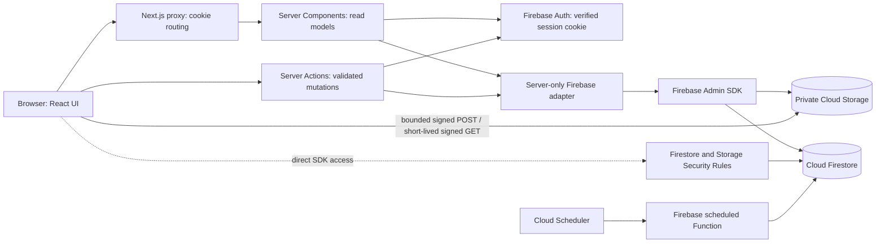

# Architecture

## Runtime overview

Firebase Authentication uses Identity Toolkit REST endpoints for e-mail/password and action codes. After sign-in the server exchanges the verified ID token for an HTTP-only session cookie; server requests verify the cookie with Firebase Admin. Firestore and Storage Admin SDK clients are server-only. The scheduled Function runs daily at 08:00 in `APP_TIMEZONE` (UTC by default) and writes in-app deadline reminders to Firestore.

## Critical authorization boundary

**The Firebase Admin SDK bypasses Firestore and Storage Security Rules.** Therefore the server-only adapter (`src/lib/firebase/compat.ts`) is an enforcement layer for its server queries and mutations: it resolves current project membership, applies role permissions, filters task/document/comment visibility, validates changed fields, and records activity. Domain-specific Server Actions in `src/server/actions/` reload access and revalidate workflow state before Admin writes. Every new Server Action, route handler, scheduled function, or Admin SDK use must perform equivalent checks. Never treat a hidden button or a Security Rule as sufficient to protect an Admin SDK endpoint.

Direct browser Firestore access is deny-by-default for domain writes. Tasks, teams, team memberships, milestones, submissions, reviews, deliverables, documents, comments, and activity are mutated through authenticated server actions. Own notification records allow only a constrained `read_at` acknowledgement. Cloud Storage is private. Uploads use a short-lived signed POST policy for a server-selected object path with content-type and 50 MB constraints; a server reservation binds the upload to its user, token, path and expiry. Signed URLs bypass Storage Rules while valid, so issuance stays behind a server permission check and lifetimes remain short.

## Research task and review lifecycle

The current canonical task states are `assigned → accepted → in_progress → submitted → under_review → approved`, with `revision_required` returning work to the researcher and `completed` available after approval. Managers can cancel permitted nonterminal tasks. Review decisions are separate records (`approved`, `revision_required`, or `rejected`); a rejected review transitions the task to `cancelled`. Each submission version and formal review is immutable. Files are explicitly linked to structured deliverables, and required deliverables are checked before a submission is accepted. Legacy persisted values (`todo`, `review`, `rejected`, and `critical`) are normalized at application-read or migration boundaries (`assigned`, `under_review`, `cancelled`, and `urgent` respectively); they are not offered as current UI states.

## Data model

Firestore collections currently used by the application include:

- `profiles/{uid}` — profile and platform flags.
- `projects/{projectId}` — research project metadata.
- `project_members/{projectId_uid}` — per-project role, active status and effective permission keys.
- `teams/{teamId}` and `team_members/{teamId_userId}` — first-class project research teams and explicit active membership relationships.
- `milestones/{milestoneId}` — project/team/researcher-scoped milestones.
- `tasks/{taskId}` — task instructions, dates, priority, team assignment, progress and canonical state.
- `deliverables/{deliverableId}` — task-specific requirements and current submission association.
- `submissions/{submissionId}` and `reviews/{reviewId}` — immutable version and decision history.
- `documents/{documentId}` and `upload_reservations/{documentId}` — private Storage metadata and short-lived upload authorization.
- `comments/{commentId}` and `activity_logs/{id}` — project/task discussion and server-written audit history.
- `notifications/{id}` — recipient-scoped in-app notices and read time, including idempotent scheduled deadline reminders.
- `permissions` and `role_permissions` — static catalogs generated from source definitions.

The authenticated UI also provides project-scoped teams and milestones, day/week/month calendar views, dashboard metrics, and project-scoped reports with authorized CSV export. Calendar and report reads use the same project/team-scoped server queries as the rest of the application. Composite indexes are source-controlled in `firestore.indexes.json`; security rules are in `firestore.rules` and `storage.rules`.

## Code layout

| Area                                        | Location                                                                                                      |
| ------------------------------------------- | ------------------------------------------------------------------------------------------------------------- |
| Firebase Admin initialization               | `src/lib/firebase/admin.ts`                                                                                   |
| Session cookie verification                 | `src/lib/firebase/server.ts`, `src/server/auth.ts`                                                            |
| Auth REST actions                           | `src/server/actions/auth.ts`, `src/lib/firebase/auth-rest.ts`                                                 |
| Firestore server adapter and authorization  | `src/lib/firebase/compat.ts`                                                                                  |
| Shared roles, state catalog and policy      | `src/lib/permissions/catalog.ts`, `policy.ts`                                                                 |
| Teams, milestones and research associations | `src/server/actions/research.ts`, `src/server/queries/research.ts`, `src/lib/domain/research-associations.ts` |
| Submissions, deliverables and reviews       | `src/server/actions/submissions.ts`, `deliverables.ts`, matching `src/server/queries/` modules                |
| Calendar, dashboard and reports             | `src/server/queries/calendar.ts`, `dashboard.ts`, `reports.ts`                                                |
| Scheduled deadline notification function    | `functions/src/index.js`                                                                                      |
| Firestore/Storage rules and indexes         | repository root: `firestore.rules`, `storage.rules`, `firestore.indexes.json`                                 |
| Emulator and migration tests                | `tests/firebase/`, `tests/migration/`, `tests/unit/`                                                          |

## Migration and deployment status

The repository retains prior Supabase SQL migrations as historical reference only. The migration importer validates and normalizes source exports; its default mode is a local dry run, and its explicit apply path is restricted to a local Firestore emulator and `demo-*` project IDs. The legacy SQL schema has no first-class team, milestone, deliverable, submission or review tables, and legacy tasks have no team/version fields; the importer fails closed on unknown tables and does not synthesize history. This implementation did **not** migrate production records, Auth users/passwords, or Storage objects, and did not deploy rules, indexes, functions, or the Next.js app. Review `docs/MIGRATION_RUNBOOK.md` and `docs/DEPLOYMENT.md` and validate in a dedicated staging Firebase project before any production rollout.
