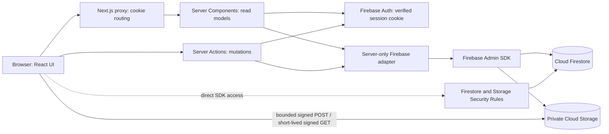

# Architecture

## Runtime overview

Firebase Authentication uses Identity Toolkit REST endpoints for e-mail/password and action codes. After sign-in the server exchanges the verified ID token for an HTTP-only session cookie; server requests verify the cookie with Firebase Admin. Firestore and Storage Admin SDK clients are server-only.

## Critical authorization boundary

**The Firebase Admin SDK bypasses Firestore and Storage Security Rules.** Therefore the server-only adapter (`src/lib/firebase/compat.ts`) is the enforcement layer for every server query and mutation: it resolves the caller's current project membership, applies role permissions, filters task/document/comment visibility, validates changed fields, and writes audit activity. Every new Server Action, route handler, or Admin SDK use must perform equivalent checks. Never treat a hidden button or a Security Rule as sufficient to protect an Admin SDK endpoint.

Direct browser Firestore access is deny-by-default except for the explicitly ruled resources and own notification read acknowledgements. Cloud Storage is private. Uploads use a short-lived signed POST policy for a server-selected object path with content-type and 50 MB constraints. Signed URLs bypass Security Rules while valid; issuance must remain behind the server permission check and the lifetime must remain short.

## Request lifecycle: update an assigned task

1. The form validates with Zod for immediate feedback.
2. A Server Action parses the untrusted input again and verifies the Firebase session.
3. The action reloads current project access and the task, then applies the shared policy (`src/lib/permissions/policy.ts`). The Firebase adapter repeats relevant checks immediately before Admin SDK mutation.
4. The adapter updates Firestore and appends an activity record; the app emits user-scoped notifications for assignment and review-state transitions.
5. The action revalidates affected Next.js routes.

## Data model

Firestore collections currently used by the application:

- `profiles/{uid}` — profile, verified e-mail, platform flags.
- `projects/{projectId}` — project metadata.
- `project_members/{projectId_uid}` — per-project role, status and effective permission keys.
- `tasks/{taskId}` — manager-controlled task definition and assigned user's progress/work notes/status.
- `documents/{documentId}` — metadata, private storage path, uploader and explicit authorized user IDs.
- `comments/{commentId}` — project/task discussion, author and content.
- `activity_logs/{id}` — server-written audit history.
- `notifications/{id}` — recipient-scoped task alerts and read time.
- `permissions` and `role_permissions` — static catalogs generated from source definitions.

Composite indexes are source-controlled in `firestore.indexes.json`. Security Rules are in `firestore.rules` and `storage.rules`.

## Code layout

| Area                                       | Location                                                                      |
| ------------------------------------------ | ----------------------------------------------------------------------------- |
| Firebase Admin initialization              | `src/lib/firebase/admin.ts`                                                   |
| Session cookie verification                | `src/lib/firebase/server.ts`, `src/server/auth.ts`                            |
| Auth REST actions                          | `src/server/actions/auth.ts`, `src/lib/firebase/auth-rest.ts`                 |
| Firestore server adapter and authorization | `src/lib/firebase/compat.ts`                                                  |
| Shared roles/policies                      | `src/lib/permissions/catalog.ts`, `policy.ts`                                 |
| Server Actions                             | `src/server/actions/`                                                         |
| Read models                                | `src/server/queries/`                                                         |
| Firestore/Storage rules and indexes        | repository root: `firestore.rules`, `storage.rules`, `firestore.indexes.json` |
| Firebase rules emulator tests              | `tests/firebase/`, `vitest.firebase.config.mts`                               |

## Known scope and migration status

The repository retains the old `supabase/` SQL migrations as historical reference only; the runtime application and setup scripts no longer use them. This code migration has not copied existing PostgreSQL rows, Supabase Auth users/passwords, or Storage objects into Firebase. A nested team entity, calendar, report builder, and versioned submission/review records are not implemented by the current migration and should not be represented as live features until added and tested.
