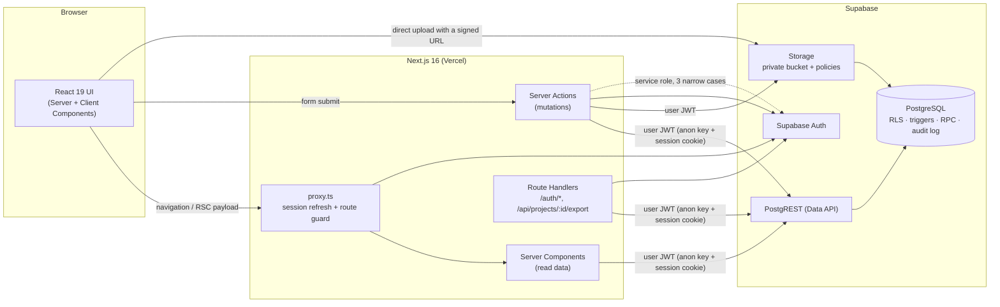
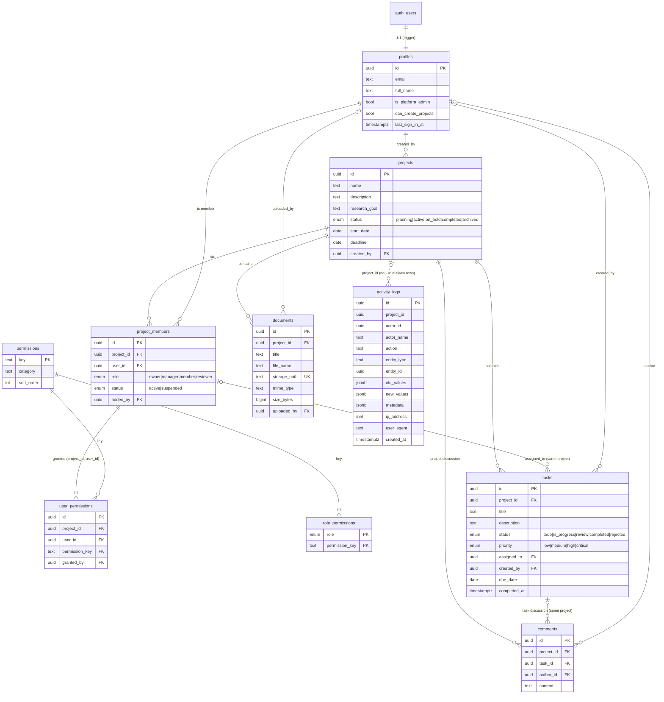

# Architecture

This document covers the architecture overview (A), folder structure (B),
database ERD (C) and implementation roadmap (F). The permission model (D) is
in [PERMISSIONS.md](./PERMISSIONS.md) and the security model (E) in
[SECURITY.md](./SECURITY.md).

## A. Architecture overview



**The database is the security boundary.** Every request reaches PostgreSQL
with the signed-in user's JWT, so Row Level Security, column privileges,
triggers and RPC checks decide what is allowed — the same checks apply whether
a request comes from this UI, from a script or from someone calling the
Supabase API directly. The Next.js layer repeats the checks to give fast,
localized error messages and to hide what a user cannot do, but it is never
the only line of defence.

### Request lifecycle (example: editing a task)

1. The browser submits the form. React Hook Form + Zod validate the input for
   immediate feedback.
2. The Server Action `updateTaskAction` (src/server/actions/tasks.ts):
   - authenticates the session (`requireSessionUser`, verified JWT claims);
   - parses the untrusted input again with the same Zod schema;
   - loads the user's **effective access from the database**
     (`get_my_project_access`) and evaluates the same policy the database
     enforces (`evaluateTaskUpdate`) to return a precise message such as
     «لا يمكنك تعديل هذه المهمة.»;
   - runs the update through the user-scoped Supabase client.
3. PostgreSQL applies, in order: the column `GRANT` (only editable columns),
   the RLS `UPDATE` policy (row gate), the `tasks_before_update` trigger
   (field-level rules: assignment, review workflow, content edits) and finally
   the audit trigger, which writes an immutable `activity_logs` row with old
   and new values.
4. The action revalidates the affected routes; Server Components re-render
   with fresh data, again read under RLS.

### Layers

| Layer            | Location                                            | Responsibility                                                                                                                                   |
| ---------------- | --------------------------------------------------- | ------------------------------------------------------------------------------------------------------------------------------------------------ |
| Route guard      | `src/proxy.ts`, `src/lib/supabase/proxy-session.ts` | Refreshes the Supabase session cookie, redirects anonymous users to `/login` and signed-in users away from auth pages.                           |
| Pages            | `src/app/**`                                        | Server Components that load data under RLS and render. Project pages share `projects/[projectId]/layout.tsx`, which denies access centrally.     |
| Server Actions   | `src/server/actions/*`                              | All mutations. Uniform pipeline: `runAction` → session → `parseInput` (Zod) → `assertProjectPermission` → user-scoped query → `revalidatePath`.  |
| Queries          | `src/server/queries/*`                              | Read models for pages (pagination, filters, joins). Always the user-scoped client.                                                               |
| Access           | `src/server/access.ts`, `src/lib/permissions/*`     | Permission catalog, role templates, pure policy functions shared by server and UI.                                                               |
| Supabase clients | `src/lib/supabase/*`                                | `server.ts` (user session, forwards IP/UA for the audit log), `client.ts` (browser), `admin.ts` (service role, server-only), `proxy-session.ts`. |
| Database         | `supabase/migrations/*`                             | Schema, permission helpers, RLS, triggers, RPCs, audit log, storage policies.                                                                    |

### Key technical decisions

- **Server Actions for mutations, Route Handlers only where HTTP semantics
  matter** (auth callbacks, file export). Actions are POST-only and protected
  by Next.js' origin check; their inputs are always re-validated.
- **Permissions are data, not code.** Roles are templates that pre-fill the
  per-project `user_permissions` rows; the effective permission set is what is
  stored. Changing what a role may do never requires a deployment.
- **Database-computed access.** The UI never derives permissions on its own:
  it asks the database (`get_my_project_access`) and only uses the answer to
  decide what to show.
- **Direct-to-Storage uploads.** A Server Action authorizes the upload and
  issues a signed upload URL for a server-chosen path
  (`<project>/<document>/<file>`); the browser uploads directly (no serverless
  body-size limits) and a second action registers the document. The database
  verifies the object exists and copies its real size and MIME type.
- **Immutable audit log written by the database.** Triggers and RPCs record
  every change, so nothing can bypass logging by skipping application code.
- **Arabic-first i18n (RTL) with English**, typed dictionaries, logical CSS
  properties and deterministic date formatting in `APP_TIMEZONE`.
- **Hand-written shadcn/ui components** (Radix primitives + Tailwind v4) kept in
  the repository, so the UI has no runtime dependency on a component registry.

### Extension points (designed for, not implemented)

| Future capability                            | Where it plugs in                                                                                                                                                                                                            |
| -------------------------------------------- | ---------------------------------------------------------------------------------------------------------------------------------------------------------------------------------------------------------------------------- |
| Organizations / multi-tenancy, subscriptions | Add `organizations` + `projects.organization_id`; child tables already reach their tenant through `project_id`, so their policies stay unchanged. Plans/limits become checks inside `create_project` / `add_project_member`. |
| Notifications, e-mail digests, webhooks      | Consume `activity_logs` (append-only event stream with actor, entity, old/new values) through a database webhook or a queue worker.                                                                                          |
| Realtime                                     | Enable Supabase Realtime on `tasks` / `comments`; RLS already filters what each subscriber receives.                                                                                                                         |
| Analytics & reports                          | Read models over `tasks` / `activity_logs`; `get_dashboard_stats` shows the pattern (invoker rights, RLS applies).                                                                                                           |
| AI features                                  | Server-side only, through Server Actions that call the model with data the user can already read (user-scoped client).                                                                                                       |
| Teams inside projects                        | A `team_id` on `project_members` plus team-scoped grants evaluated in `private.member_has_permission`.                                                                                                                       |

## B. Folder structure

```text
research-team-platform/
├── docs/                         Architecture, permission and security docs
├── scripts/
│   ├── seed.ts                   Demo users + demo project (acts through the real API)
│   ├── promote-admin.ts          Make an existing user a platform admin
│   ├── generate-types.ts         Generate src/types/database.types.ts from a database
│   ├── test-db-local.sh          pgTAP suite on plain PostgreSQL (no Docker)
│   └── sql/supabase-shim.sql     Minimal Supabase objects for test-db-local.sh only
├── supabase/
│   ├── config.toml               Local stack configuration (Supabase CLI)
│   ├── migrations/               0100 schema · 0200 permission catalog · 0300 helpers ·
│   │                             0400 auth→profiles · 0500 business rules · 0600 audit ·
│   │                             0700 RPCs · 0800 RLS + grants · 0900 storage
│   ├── templates/                Auth e-mail templates (token_hash links, AR + EN)
│   └── tests/database/           pgTAP tests (185 assertions)
├── src/
│   ├── proxy.ts                  Session refresh + route protection (Next.js 16 proxy)
│   ├── app/
│   │   ├── (auth)/               login, signup, forgot-password, reset-password
│   │   ├── (app)/                dashboard, projects/**, tasks, documents, team, activity, settings
│   │   ├── auth/confirm|callback e-mail link verification (token_hash / PKCE)
│   │   └── api/projects/[projectId]/export   CSV / JSON export (audited)
│   ├── components/
│   │   ├── ui/                   shadcn/ui primitives
│   │   ├── layout/               sidebar, mobile nav, user menu, locale & theme switch
│   │   └── <feature>/            dashboard, projects, tasks, documents, team, comments, activity, settings
│   ├── lib/
│   │   ├── permissions/          catalog.ts (keys, templates) · policy.ts (pure rules) · access.ts
│   │   ├── validation/           Zod schemas shared by forms and Server Actions
│   │   ├── i18n/                 ar/en dictionaries, formatting, provider
│   │   ├── supabase/             server / browser / admin / proxy clients
│   │   ├── errors.ts             Error codes + database error mapping
│   │   └── env.ts, env.server.ts Validated configuration
│   ├── server/
│   │   ├── actions/              Server Actions (mutations)
│   │   ├── queries/              Read models used by pages
│   │   ├── access.ts             Effective access from the database
│   │   ├── action.ts             runAction / parseInput / unwrap
│   │   └── auth.ts               Session helpers, platform-admin bootstrap
│   └── types/                    database.types.ts (generated) · app.ts (DTOs)
└── tests/
    ├── unit/                     Vitest: policies, validation, errors, files, activity, catalog parity
    └── integration/              Vitest: direct API attacks against a running Supabase stack
```

## C. Database ERD



Notes:

- All primary keys are UUIDs; every table has `created_at` (and `updated_at`
  where rows change, maintained by triggers).
- Composite foreign keys keep data consistent inside a project: an assignee
  must be a member of the task's project (`tasks (project_id, assigned_to)` →
  `project_members`), a task comment must belong to the task's project, and a
  permission grant only exists for an existing membership (removing a member
  removes their grants and un-assigns their tasks).
- `documents.storage_path` must start with `<project_id>/<document_id>/`
  (CHECK constraint), which ties every file to its project folder.
- `activity_logs` deliberately has no foreign keys: audit entries outlive the
  rows they describe, and actor name/e-mail are snapshotted.
- Indexes cover every foreign key and the access paths of the UI (tasks by
  project/status/assignee/due date, comments by task/project, logs by project
  and time, permissions by user).

## F. Implementation roadmap

Each phase leaves the application in a runnable state.

| Phase                   | Scope                                                                                                                | Runnable result                                   |
| ----------------------- | -------------------------------------------------------------------------------------------------------------------- | ------------------------------------------------- |
| 1. Foundation           | Next.js 16 + TypeScript + Tailwind v4 + shadcn/ui, i18n (ar/en, RTL), theme, env validation, Supabase clients, proxy | App boots; public pages render                    |
| 2. Data model           | Migrations 0100–0400: schema, permission catalog, helpers, auth → profiles                                           | `supabase db reset` builds the schema             |
| 3. Security core        | Migrations 0500–0900: business-rule triggers, audit log, RPCs, RLS + column grants, storage policies; pgTAP suite    | `npm run test:db` proves the rules without any UI |
| 4. Authentication       | Login, sign-up, e-mail confirmation, forgot/reset password, logout, protected routes, platform-admin bootstrap       | Users can register and sign in                    |
| 5. Projects & team      | Projects CRUD, members, invitations, role templates, per-member permission matrix, suspension, ownership transfer    | Owners can build and govern a team                |
| 6. Work                 | Tasks (filters, workflow, assignment), comments, documents (signed uploads/downloads)                                | Day-to-day research work                          |
| 7. Insight              | Dashboard (KPIs, charts with table view), activity log (filters, diffs), CSV/JSON export                             | Managers see progress and history                 |
| 8. Hardening & delivery | Seed data, unit + integration tests, security headers, docs, CI                                                      | `npm run seed` → full demo; CI green              |

Future phases (not implemented): notifications, realtime collaboration,
organizations/subscriptions, advanced analytics and reports, AI assistance —
see _Extension points_ above.
